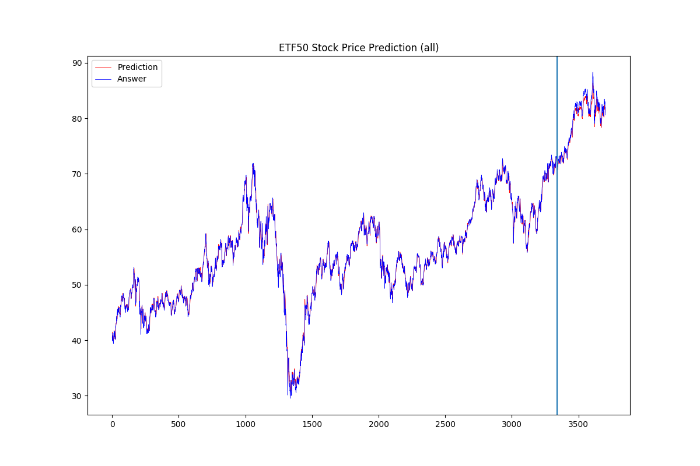
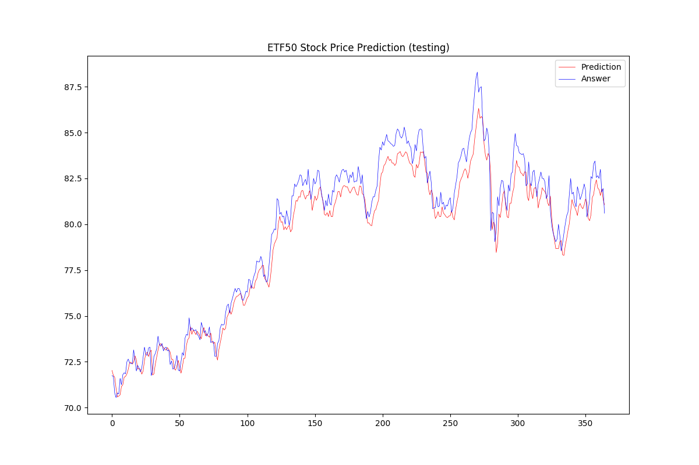

# Task1-Tagging_of_Thesis

#### Reproduce

#### Install Environment

```
$ python3 -m venv fund
$ . ./fund/bin/activate
$ pip -r requirements.txt
```
#### Run Tensorboard Visualization

Run below command at the project root, then server will open at `http://localhost:1357`
```
$ tensorboard --logdir saved/log/ --port 1357
```

#### Training

```
$ python train.py -c config.json -d 0
```

#### Testing

```
$ python test.py -c config.json -d 0 --resume saved/models/StockNet/1010_013058/model_best.pth
```

## Note

* If I does not normalize the data, model will always predict the same value like 54.

* My train curve (loss and difference): http://meow2.csie.ntu.edu.tw:8787/#scalars

* prediction curve (training + testing phase)

  

* prediction curve (only testing phase)

  

